<h1 align="center">Hey, I'm Jit 👋</h1>

<h3 align="center">Turning curiosity into code, and ideas into real projects 🚀</h3>

🛠️ Tech Stack

🚀 Featured Projects
<table>
<tr>
<td width="50%">

🎵 YouTube Music Alexa Skill
Self-hosted YouTube Music integration for Alexa/Echo — voice playback, recommendation radio, playlists, audio streaming proxy, and web remote control.
Python

</td>
<td width="50%">

🌿 Herbguard
Blockchain-powered medicinal herb traceability platform — AI plant identification, geolocation verification, OCR lab reports, tamper-evident hash-chain logging on Polygon Amoy.
TypeScript

</td>
</tr>
<tr>
<td width="50%">

💰 Expense Tracker
Personal finance tracker for expenses, income, accounts, subscriptions, budgets, and spending reports with secure Supabase auth and offline mode.
JavaScript

</td>
<td width="50%">

🔐 Secure File Transfer
Self-hosted encrypted file transfer — AES-256-GCM encryption, WebAuthn passkeys, TOTP auth, and chunked uploads.
JavaScript

</td>
</tr>
<tr>
<td width="50%">

📥 YT Video Downloader
Web app for downloading YouTube videos.
JavaScript

</td>
<td width="50%">

📷 QR Code Reader
Zero-backend, zero-tracking browser QR scanner, reader, and generator with camera scanning and image decoding.
HTML/JS

</td>
</tr>
</table>

<i>📌 Pin these on your profile: go to any repo → click the "..." → Pin, or use Customize pins on your profile page.</i>

📊 GitHub Stats

<i>Stats auto-refresh daily via GitHub Actions — no external dependency, no rate-limit outages.</i>

<i>⚡ Currently building: self-hosted services, AI-assisted workflows, and things that probably don't need to exist but were fun to make.</i>
</p
